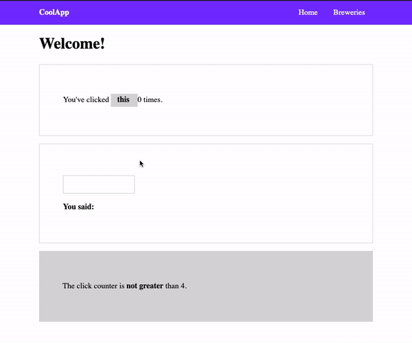

# helloAngular

The aim of this project is to showcase what I have learnt from the following Angular crash course:
https://www.youtube.com/watch?v=_TLhUCjY9iA publised by DesignCourse on 16 Jul 2019

## Here is the output of the code


The project contains the usage of the following Angular elements:
* Components / Services
* Routing
* Data Binding
* ng-template
* ngStyle
* HTTP Client

These are the Angular CLI commands I learnt:
```
ng new <app-name>
ng serve -o
ng g c <component_name>
ng g s http
ng build --prod
```
